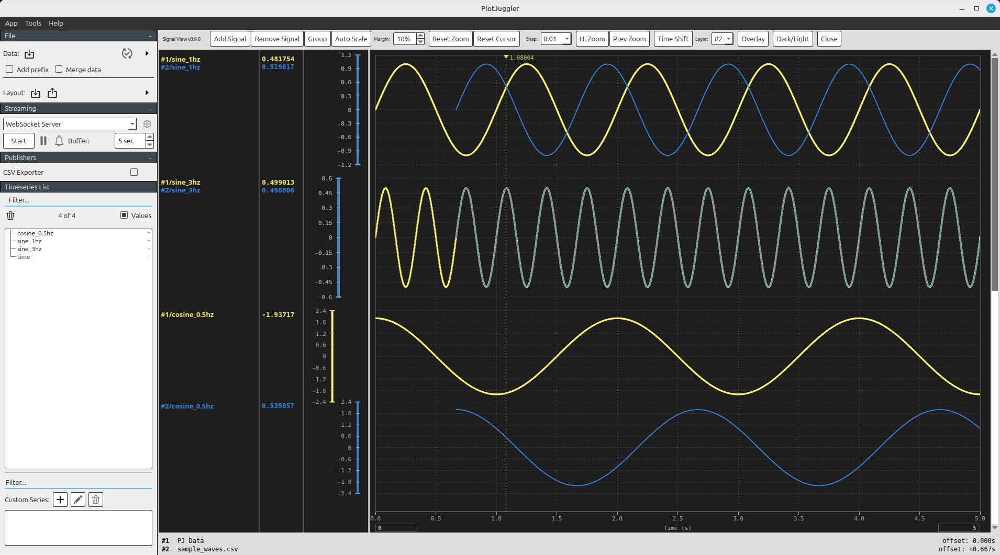

# Signal View plugin for PlotJuggler


An oscilloscope-style signal viewer plugin for [PlotJuggler](https://github.com/facontidavide/PlotJuggler). Displays time series data as step-wise (staircase) traces with individually positionable Y-axis bars, multi-file overlay comparison, and time shifting.



## Features

- **Step-wise signal traces** with per-pixel downsampling for smooth rendering at any zoom level
- **Three-column Y-axis panel**: signal names, cursor readout values, and draggable Y-axis bars with tick marks
- **Multi-file data overlay**: load CSV files on top of PlotJuggler data for side-by-side comparison; right-click the data-sets footer to remove individual overlays or clear all at once
- **Time shifting**: drag to shift any data layer's time offset for alignment
- **Flexible signal bands**: independently position, resize, and group signal display regions
- **Signal context menu**: right-click any signal's name, value, or Y-axis bar to auto-scale, change style, or remove — applies to all selected signals when the right-clicked signal is part of the selection
- **Selection and batch editing**: select signals with click, Ctrl+click, rubber band, or Ctrl+A; edit properties in bulk via the Y-range table dialog
- **Customizable appearance**: per-signal color, line style, line width, marker style, and Y-axis divisions
- **Layout persistence**: full save/restore of signal configuration, overlays, and view state via PlotJuggler layout files
- **Plot cursor navigation**: double-click to jump the cursor, drag within 5 px to slide it, or use left/right arrow keys for single-pixel steps
- **Dark/Light theme**: toggle between dark (default) and light mode; signal colors are converted via an invertible HSL lightness mirror so switching back always restores the original colors exactly; theme is saved and restored with the layout

## Requirements

- PlotJuggler 3.x (built and installed from source)
- Qt 5
- CMake 3.16+
- fmt library (bundled with PlotJuggler)

**Linux (Ubuntu/Debian):**

```bash
sudo apt install qtbase5-dev cmake
```

**Windows:**

- Visual Studio 2026 with the v142 (VS 2019) C++ toolchain installed
- Qt 5.15 via [aqtinstall](https://github.com/miurahr/aqtinstall): `pip install aqtinstall && aqt install-qt windows desktop 5.15.2 win64_msvc2019_64 -O C:\Qt`
- PlotJuggler must be [built from source](https://github.com/facontidavide/PlotJuggler) and installed via `cmake --install` to produce the install tree

## Building

### Linux

If `plotjuggler` is on your PATH, the build script auto-detects the install prefix:

```bash
./build.sh
```

Otherwise, set `PJ_INSTALL_DIR` manually:

```bash
PJ_INSTALL_DIR=/path/to/plotjuggler-install ./build.sh
```

### Windows

If both `qmake` and `plotjuggler` are on your PATH, the build script auto-detects both:

```bat
build.bat
```

Otherwise, set the directories manually:

```bat
set QT_DIR=C:\Qt\5.15.2\msvc2019_64
set PJ_INSTALL_DIR=C:\path\to\plotjuggler-install
build.bat
```

The script defaults to Visual Studio 2026. To use Visual Studio 2022 instead:

```bat
build.bat vs2022
```

Both generators require the **v142 (VS 2019) C++ toolchain** to be installed, as Qt 5.15 was built against it.

## Running

### Linux

```bash
./run.sh                        # launch PlotJuggler with the plugin
./run.sh -d data.csv            # load a data file
./run.sh -l layout.xml          # restore a saved layout
```

### Windows

```bat
run.bat                         # launch PlotJuggler with the plugin
run.bat -d data.csv             # load a data file
run.bat -l layout.xml           # restore a saved layout
```

Any additional arguments are passed through to PlotJuggler.

Then go to **Tools > Signal View** to open the plugin.

## Usage

1. Click **Add Signal** to add signals to the view
2. Double-click a signal name, value, or bar to edit properties (color, line style, Y range, etc.)
3. Right-click a signal name, value, or bar to auto-scale, change style, or remove (applies to all selected signals)
4. Click **Overlay** to load a CSV file for comparison; right-click the data-sets footer to rename, remove, or clear all overlays
5. Toggle **Time Shift** and drag on the canvas to align data layers
6. Toggle **H. Zoom** and drag to zoom into a time range
7. Click **Dark/Light** to switch themes

## Testing

### Linux

Run the unit tests with:

```bash
./test.sh
```

This builds with Google Test and runs all test suites via CTest. Tests cover name parsing, overlay manager logic, axis layout calculations, CSV parsing, UI widget interactions, and Dark/Light theme logic.

To output JUnit XML results (used by CI for test reporting):

```bash
JUNIT_OUTPUT=test-results.xml ./test.sh
```

### Windows

```bat
test.bat
```

To use Visual Studio 2022:

```bat
test.bat vs2022
```

To output JUnit XML results:

```bat
set JUNIT_OUTPUT=test-results.xml
test.bat vs2022
```

## Coding Conventions

- Google C++ formatting (`clang-format -style=Google`)
- Qt naming conventions: `m_` member prefix, `UPPER_CASE` constants, `camelCase` functions, `PascalCase` classes

## Project Structure

```
src/
  signal_view_plugin.h/cpp   Plugin entry point (PJ::ToolboxPlugin)
  signal_view_widget.h/cpp   Main widget: toolbar, layout, signal management
  plot_canvas.h/cpp          Time series rendering and mouse interaction
  y_axis_panel.h/cpp         Signal name, value, and Y-axis bar columns
  overlay_manager.h/cpp      Multi-layer data management and CSV loading
  data_sets_panel.h/cpp      Footer panel listing loaded data layers
```
